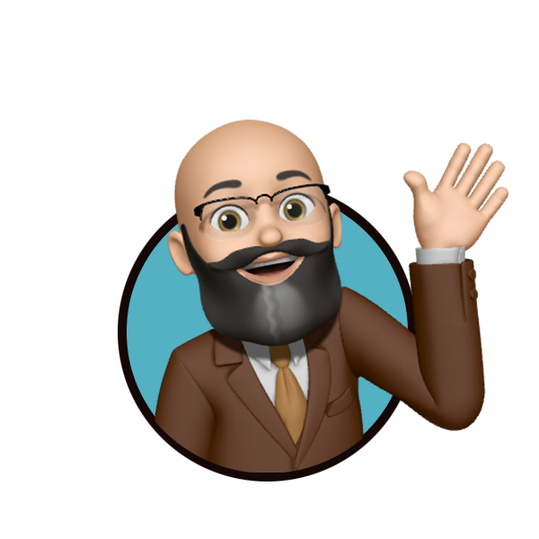

<!--  -->
<!-- [] (https://www.instagram.com/lehisanchez/) --> 

# Hello 👋 I'm Lehi!

I develop Ruby on Rails applications for [@ccsomd](https://github.com/ccsomd).

## 👨🏻‍💻 Developer Skill Set

## 🧰 My Favorite Tools

## 🙋🏻‍♂️ More About Me

### ⚡️ I'm currently...

- 🇫🇷 Learning French
- 🎧 Listening to [MxPx](https://mxpx.com/)
- 📚 Reading–
  - [A Walk in the Park: The True Story of a Spectacular Misadventure in the Grand Canyon](https://www.goodreads.com/book/show/199798198-a-walk-in-the-park)
  - [Tokyo Vice](https://www.goodreads.com/book/show/6658129-tokyo-vice)

### 📡 Favorite Podcasts

- ⚽️ [After The Whistle](https://podcasts.apple.com/us/podcast/after-the-whistle-with-brendan-hunt-and-rebecca-lowe/id1654074926)
- 📚 [Bookworm](https://bookworm.fm/)
- 💡 [BYU Speeches](https://speeches.byu.edu/)
- ⚽️ [Football Weekly](https://www.theguardian.com/football/series/footballweekly)
- ✍️ [How I Write](https://podcasts.apple.com/us/podcast/how-i-write/id1700171470)
- 🧘🏻‍♂️ [The One You Feed](http://oneyoufeed.net/)
- ✍🏻 [Poetry Unbound](https://onbeing.org/series/poetry-unbound/)
- ⚙️ [The Rework Podcast](https://37signals.com/podcast)
- 🎻 [Sticky Notes: The Classical Music Podcast](http://stickynotespodcast.libsyn.com/)
- 💡 [Y Religion](https://rsc.byu.edu/yreligion)

<!--
**lehisanchez/lehisanchez** is a ✨ _special_ ✨ repository because its `README.md` (this file) appears on your GitHub profile.

Here are some ideas to get you started:

- 🔭 I’m currently working on ...
- 🌱 I’m currently learning ...
- 👯 I’m looking to collaborate on ...
- 🤔 I’m looking for help with ...
- 💬 Ask me about ...
- 📫 How to reach me: ...
- 😄 Pronouns: ...
- ⚡ Fun fact: ...
-->
